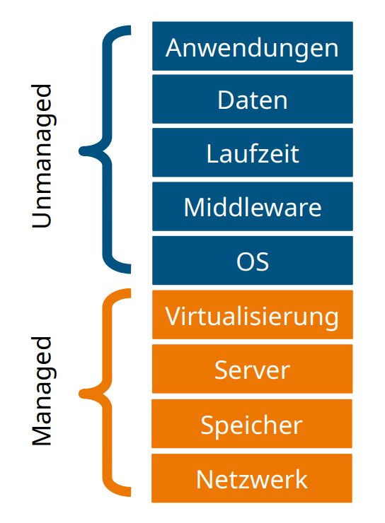
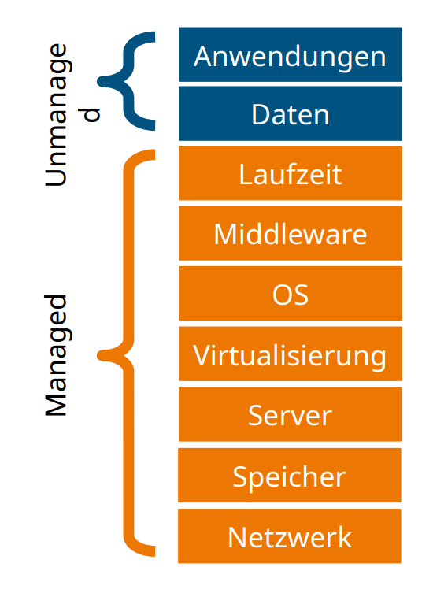
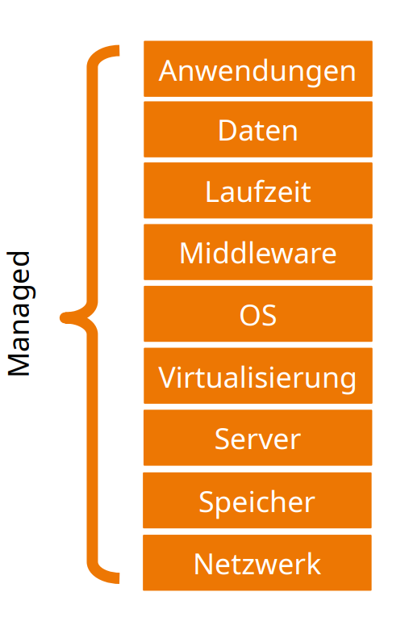
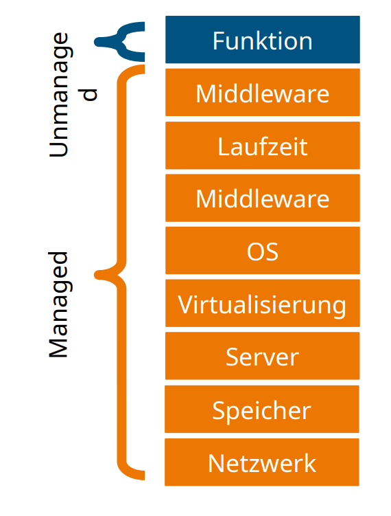

# Servicemodelle

## Cloud-Servicemodelle erklärt

Die verschiedenen Cloud-Servicemodelle bieten unterschiedliche Ebenen der Bereitstellung und Verwaltung von IT-Services. Diese Modelle lassen sich oft anhand des "Pizza-Prinzips" veranschaulichen.

**Das Pizza-Prinzip:**

| Cloud-Servicemodelle | Pizza as a Service |
|----------------------|---------------------|
| **IaaS (Infrastructure as a Service)** | Selbstgemachte Pizza aus Zutaten des Supermarkts. Du kontrollierst die Zubereitung, aber die Vorbereitung erfordert deine Mühe. |
| **PaaS (Platform as a Service)** | Pizza im Restaurant mit vorgefertigtem Teig und Auswahl an Belägen. Du gestaltest die Pizza, aber die Basis und Infrastruktur sind bereitgestellt. |
| **SaaS (Software as a Service)** | Bestellung einer fertigen Pizza beim Lieferdienst. Du nutzt die Anwendung, ohne Installation oder Wartung. |
| **FaaS (Function as a Service)** | Vorgefertigte Pizzateile, die du in deinen eigenen Pizzateig einfügst. Du fügst Geschäftslogik hinzu, die Plattform kümmert sich um den Rest. |

## Infrastructure as a Service (IaaS)

**Beschreibung:** IaaS bezieht sich auf die Miete von Infrastruktur, wie virtuellen Maschinen und Netzwerken. Die Verwaltung der Hardware und Ressourcen liegt in der Verantwortung des Anbieters.  
**Vorteile:** Flexibilität, Skalierbarkeit, Kontrolle über Konfiguration.  
**Nachteile:** Benötigt weiterhin Management von Betriebssystemen und Anwendungen, technisches Fachwissen.

## Platform as a Service (PaaS)

**Beschreibung:** PaaS stellt eine vorgefertigte Entwicklungsplattform bereit, auf der Entwickler Anwendungen erstellen und ausführen können. Die zugrunde liegende Infrastruktur und Wartung werden vom Anbieter übernommen.  
**Vorteile:** Schnellere Entwicklung, automatisierte Skalierung, geringerer Wartungsaufwand.  
**Nachteile:** Eingeschränkte Kontrolle über die zugrunde liegende Infrastruktur, begrenzte Anpassungsmöglichkeiten.

## Software as a Service (SaaS)

**Beschreibung:** SaaS bietet vollständige Anwendungen über das Internet an. Nutzer können die Anwendungen über den Webbrowser nutzen, ohne sich um Installation oder Wartung kümmern zu müssen.  
**Vorteile:** Einfacher Zugang, keine Installation erforderlich, automatische Updates.  
**Nachteile:** Begrenzte Anpassungsmöglichkeiten, Abhängigkeit vom Anbieter, Datenschutzüberlegungen.

## Function as a Service (FaaS)

**Beschreibung:** FaaS ermöglicht die Ausführung von isolierten Funktionen oder Geschäftslogik in einer Serverless-Umgebung. Entwickler fügen ihre Funktionen hinzu, ohne sich um die zugrunde liegende Infrastruktur kümmern zu müssen.  
**Vorteile:** Skalierbare Ausführung, Kostenoptimierung, Fokus auf Geschäftslogik.  
**Nachteile:** Beschränkungen bei Laufzeit und Umgebung, Abhängigkeit von Plattformanbietern.

## Weitere Servicevarianten (XaaS)

**Beschreibung:** Neben den vier Hauptmodellen gibt es viele andere Cloud-Servicevarianten (XaaS), die spezifische Funktionen oder Dienstleistungen bieten. Diese können Datenbanken, Identitätsmanagement, Logging und mehr umfassen.  
**Beispiel:** Database as a Service (DBaaS) bietet Cloud-basierte Datenbankdienste, während Identity as a Service (IDaaS) Lösungen für Identitätsmanagement bereitstellt.

## Fazit

Die verschiedenen Cloud-Servicemodelle bieten Flexibilität und Effizienz bei der Bereitstellung von IT-Services. Die Wahl des Modells hängt von den Anforderungen, Fähigkeiten und Zielen eines Unternehmens ab. Es ist wichtig, offene Standards zu berücksichtigen, um einen Vendor-Lock-In zu vermeiden und die langfristige Flexibilität zu gewährleisten.

### Quellen
- Jann seine Notizen vom Ük/ZLI
- Eigenes bestehendes Wissen
- ChatGPT
- Ressourcen vom Gitlab Repo