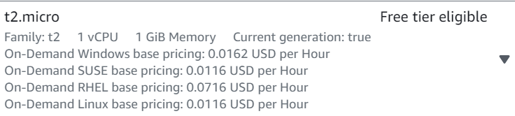
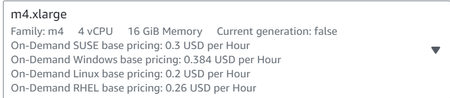

# Erkunden von AWS On-Demand Pricing und Instanzvergleich in der Management Console

---

## Ausgangslage

In dieser Übung werden Sie die AWS Management Console verwenden, um das On-Demand Pricing-Modell von Amazon EC2 kennenzulernen. Sie werden einen Vergleich zwischen den Instanztypen t2.micro und m4.xlarge (Region Nord-Virginia) für einen Monat durchführen.

---

# Kostenvergleich AWS-Instanztypen

## Instanztyp t2.micro

- **Stündlicher Preis:** $0.0116 pro Stunde (Stand: September 2021).
- **Monatsstunden:** 24 Stunden/Tag * 30 Tage = 720 Stunden (angenommen).
- **Monatliche Kosten:** $0.0116/Stunde * 720 Stunden = $8.35 pro Monat.

### Use-Cases für t2.micro

- **Einfache Webanwendungen:** T2.micro-Instanzen eignen sich gut für einfache Webanwendungen mit geringem Traffic und geringen Rechenanforderungen.
- **Entwicklungsumgebungen:** Ideal für Entwicklungs- und Testumgebungen, in denen kostengünstige Ressourcen benötigt werden.

### Technische Details für t2.micro

- **CPU:** 1 virtuelle CPU.
- **RAM:** 1 GB.
- **Netzwerkleistung:** Moderate Netzwerkleistung.
- **Speicher:** EBS-Speicherzugriff.

### Verständnis der Auswirkungen für t2.micro

Die t2.micro-Instanzen sind kostengünstig, aber begrenzt in ihrer Rechenleistung und Ressourcen. Sie eignen sich gut für leichte Workloads und Umgebungen, in denen Kostenoptimierung eine Priorität ist. Allerdings sind sie nicht für anspruchsvolle Aufgaben geeignet.

## Instanztyp m4.xlarge

- **Stündlicher Preis:** $0.20 pro Stunde (Stand: September 2021).
- **Monatsstunden:** 24 Stunden/Tag * 30 Tage = 720 Stunden (angenommen).
- **Monatliche Kosten:** $0.20/Stunde * 720 Stunden = $144 pro Monat.

### Use-Cases für m4.xlarge

- **Datenintensive Anwendungen:** M4.xlarge-Instanzen sind gut geeignet für datenintensive Anwendungen und Datenbankserver.
- **Anwendungen mit hoher Leistungsanforderung:** Ideal für Anwendungen, die eine hohe Rechenleistung und Speicherbandbreite benötigen.

### Technische Details für m4.xlarge

- **CPU:** 4 virtuelle CPUs.
- **RAM:** 16 GB.
- **Netzwerkleistung:** Hohe Netzwerkleistung.
- **Speicher:** EBS-Speicherzugriff. ( Elastic Block Store (EBS) ermöglicht in Amazon Web Services (AWS) den Speicherzugriff auf Blockebene, indem es virtuelle Blockgeräte an EC2-Instanzen anhängt und persistente, skalierbare Speicherlösungen bereitstellt.)

### Verständnis der Auswirkungen für m4.xlarge

Die m4.xlarge-Instanzen bieten höhere Leistung und Ressourcen, sind jedoch kostenintensiver. Sie eignen sich für anspruchsvolle Aufgaben und Anwendungen mit hohen Leistungsanforderungen. Die Auswahl dieses Instanztyps führt zu höheren monatlichen AWS-Kosten.

## Kostentabelle für Windows

| Instanztyp | Stündlicher Preis ($) | Monatsstunden | Monatliche Kosten ($) |
|------------|-----------------------|---------------|-----------------------|
| t2.micro   | 0.0162                | 720           | 11.664 |
| m4.xlarge  | 0.384                  | 720           | 276.48                  |

## t2.micro

## m4.xlarge

