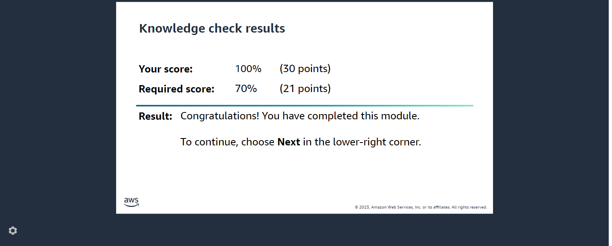
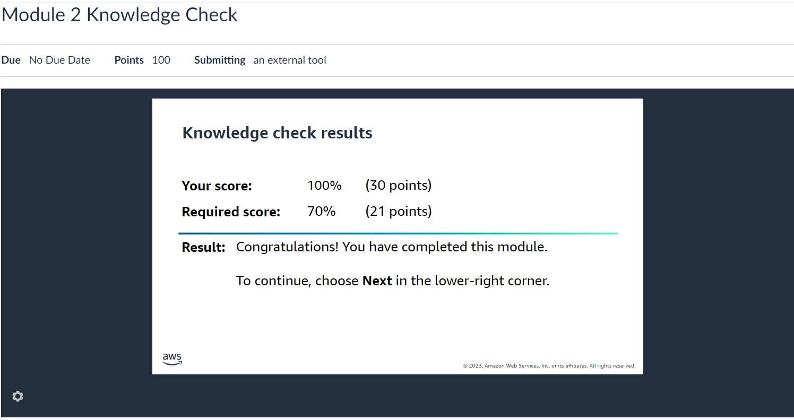
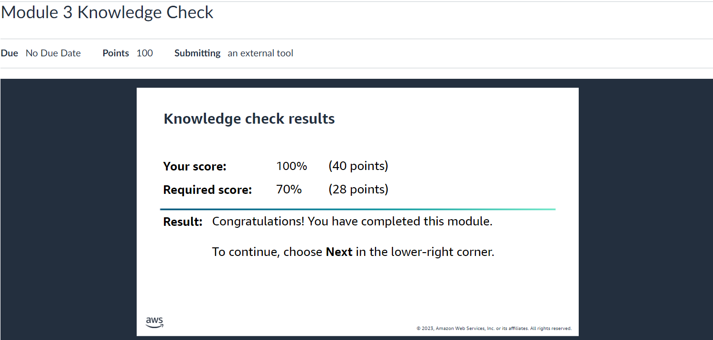
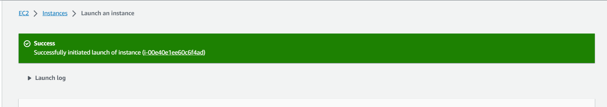
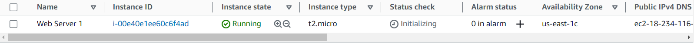
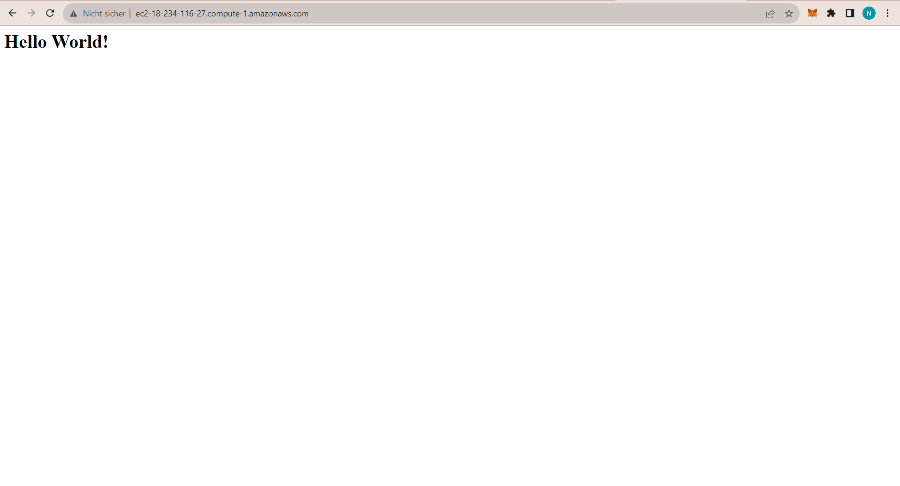
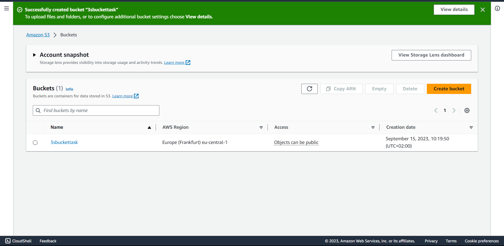
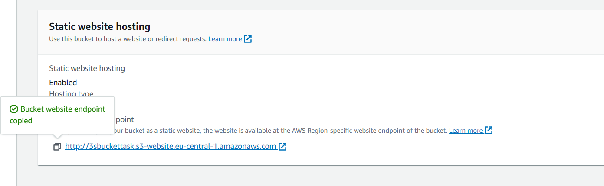
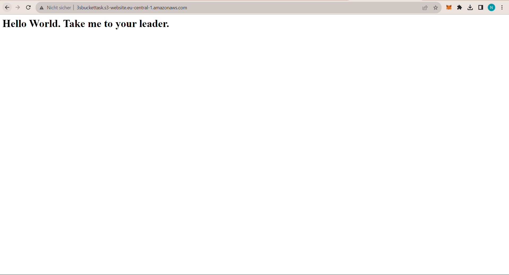

# Herausforderungen

## A) AWS-Kurs (Zwei Lab-Übungen)

**Ausgangslage:**
- Die ersten drei Module sind informativ und sollten schnell durchgegangen werden.
- Im vierten Modul gibt es praktische Übungen, bei denen Sie schrittweise mit virtuellen Maschinen (EC2) und Storage Buckets (S3) arbeiten.

**Schritte:**
1. Öffnen Sie den Kurs "AWS Academy Introduction to Cloud: Semester 1".
2. Arbeiten Sie sich durch die ersten 4 Module:
   - Globale Infrastruktur
   - Strukturen der Cloud
   - AWS-Konsole
   - Virtuelle Server
   (Sie müssen die Knowledge Checks nicht durchführen, dürfen es aber.)

3. Das zweite Kapitel im Modul 4 heißt "Lab 4.1 - EC2". Dieses Lab ist der erste Kompetenznachweis dieser Herausforderung (Details unten).
4. Das zweite Kapitel im Modul 4 heißt "Lab 4.2 - S3". Dieses Lab ist der zweite Kompetenznachweis dieser Herausforderung (Details unten).
5. Führen Sie beide Labs durch und achten Sie auf die jeweiligen Anforderungen für den Leistungsnachweis.
---
## Aufgaben

# Modul 1: Globale Infrastruktur

# Globale Infrastruktur

**Zweck des Moduls:**
- Grundlagen des Cloud-Computings überprüfen.
- Vorteile des Cloud-Computings und Gründe für den Wechsel von On-Premises-Computing behandeln.
- Hauptdienste von Cloud-Computing-Anbietern erläutern.

**Modulbeschreibung:**
- Notizen zu den Vorteilen des Cloud-Computings und den von Anbietern angebotenen Diensten machen.
- Auswirkungen des Cloud-Computings besprechen.

**Technologiebegriffe:**
- Informationen zu den Begriffen Cloud Computing, Amazon Web Services (AWS), Cloud-Speicher und Server.

**Hintergrund und Missverständnisse:**
- Cloud Computing als Online-Nutzung von Ressourcen erklären.
- Vorteile für Unternehmen, darunter geringere Kosten und weltweite Verfügbarkeit, hervorheben.

**Beispiel: Cloud-basierte E-Mail-Dienste**
- Beispiel für globale Infrastruktur: Cloud-basierte E-Mail-Dienste wie Gmail oder

### Test dazu

---

## Structures of the Cloud

**Modul-Zusammenfassung:**
- Dieses Modul erkundet die architektonischen Komponenten und Strukturen, die das Cloud Computing ausmachen.

**Schlüsselkonzepte:**
- **Cloud-Bereitstellungsmodelle:**
  - Public Cloud: Dienste über das öffentliche Internet von Drittanbietern.
  - Private Cloud: Infrastruktur und Dienste für eine Organisation.
  - Hybrid Cloud: Kombiniert öffentliche und private Modelle.
  - Community Cloud: Geteilte Infrastruktur für Organisationen mit gemeinsamen Interessen.

- **Cloud-Dienstmodelle:**
  - Infrastructure as a Service (IaaS): Virtuelle Ressourcen über das Internet.
  - Platform as a Service (PaaS): Plattform für Anwendungsentwicklung.
  - Software as a Service (SaaS): Anwendungen über das Internet.

- **Architektonische Komponenten:**
  - Rechenzentren: Physikalische Einrichtungen für Hardware.
  - Virtualisierung: Erzeugt virtuelle Ressourcen.
  - Lastausgleich: Verteilt Netzwerkverkehr für Leistung und Zuverlässigkeit.
  - Skalierbarkeit: Anpassung von Ressourcen basierend auf Bedarf.

**Beispiel: Wahl eines Cloud-Modells:**
- Angenommen, ein Unternehmen möchte seine E-Commerce-Website hosten:
  - Public Cloud: Kosteneffizient bei variablen Website-Traffic.
  - Private Cloud: Mehr Kontrolle und Sicherheit für sensible Daten.
  - Hybrid Cloud: Nahtlose Integration mit lokalen Systemen.

## Test dazu

---

## AWS Console

**Zweck der AWS Console:**
Die AWS Console ist eine webbasierte Benutzeroberfläche, die es Benutzern ermöglicht, auf die verschiedenen Dienste und Ressourcen von Amazon Web Services (AWS) zuzugreifen und sie zu verwalten. Dieses Modul führt Sie in die Verwendung der AWS Console ein, um gängige AWS-Dienste zu nutzen und zu navigieren.

**Beschreibung des Moduls:**
- Das Modul beginnt mit einer vom Ausbilder geleiteten Aktivität, in der Sie die grundlegenden AWS-Services kennenlernen.
- Anschließend werden Sie aufgefordert, in der AWS Console zu üben und zu lernen, wie Sie auf verschiedene Dienste zugreifen können.
- Abschließend werden Sie an einer Forschungsaktivität teilnehmen, um herauszufinden, wie diese Dienste in verschiedenen Branchen real-world Anwendung finden.

**Verwendete Technologiebegriffe:**
- In diesem Modul werden verschiedene technologische Begriffe eingeführt, darunter:
   - Amazon Simple Storage Service (Amazon S3)
   - Amazon Elastic Compute Cloud (Amazon EC2)
   - Amazon Elastic Block Store (Amazon EBS)
   - Amazon Relational Database Service (Amazon RDS)
   - Amazon DynamoDB
   - AWS Lambda
   - Amazon Virtual Private Cloud (Amazon VPC)
   - AWS Identity and Access Management (IAM)
   - AWS CloudTrail
   - Amazon CloudWatch
   - Amazon Redshift

**Fokusfragen:**
- Im Laufe des Moduls werden verschiedene Fragen diskutiert, darunter:
   1. Welchen Cloud-Service verwenden Sie regelmäßig, und wie profitieren Sie davon? Gibt es mögliche Nachteile bei der Verwendung dieses Dienstes?
   2. Wie könnten Sie in der Zukunft PaaS- oder IaaS-Cloud-Services verwenden und wie würden sie Ihnen in Ihrer Karriere oder bei der Erreichung Ihrer Ziele helfen?
   3. Welche Erfahrungen haben Sie mit der AWS Console und den AWS-Services gemacht? Welche Dienste haben Sie bereits genutzt, erstellt oder möchten Sie mehr darüber erfahren?

Die AWS Console ist ein Schlüsselwerkzeug zur Verwaltung von AWS-Ressourcen und -Diensten, und dieses Modul bietet Ihnen eine Einführung in deren Nutzung.

## Test dazu

---

## Virtual Servers
- **Modulzweck:** Lernen, wie man eine Amazon EC2-Instanz erstellt, eine Website hostet und die Bedeutung von Zugriffsschlüsseln, DNS, Amazon Route 53 und Virtual Private Clouds (VPCs) versteht.

- **Amazon EC2:** Ein AWS-Dienst, der skalierbare Rechenleistung in der Cloud bereitstellt.

- **Amazon S3:** Ein AWS-Dienst zur Speicherung von Daten in der Cloud.

- **DNS:** Das Domain Name System zur Übersetzung von Domainnamen in IP-Adressen.

- **S3 Bucket:** Ein Speicherbehälter für Daten und Websites in Amazon S3.

- **Policy:** Regeln für Sicherheit und Zugriffsrechte in AWS, oft in JSON verfasst.

- **Domainname:** Die eindeutige Adresse einer Website.

- **Amazon Route 53:** Ein DNS-Webdienst zur Domainregistrierung und -verwaltung.

- **VPC:** Ein privates Netzwerk für AWS-Ressourcen, das Zugriff kontrolliert.

- **Dynamische Website:** Erfordert Serverinteraktion zur Beantwortung von Anfragen.

- **Statische Website:** Bietet unveränderte Inhalte ohne Serverinteraktion.

- **Hintergrund:** EC2 bietet Cloud-Rechenleistung. Datenschutzkontrollen sind wichtig. Richtlinien steuern Zugriffsrechte. Route 53 ermöglicht Domainregistrierung.

- **Empfehlung:** EC2-Instanzen und S3-Buckets in einer VPC erstellen, um Zugriff und Sicherheit zu kontrollieren.
---
## Lab 4.1
- Instanz wurde gelauncht

- Alle aktiven Instanzen

- Server erfolgreich gestartet

---
## Lab 4.2
- **Bucket wurde erfolgreich created**

- **Unten sieht man den Link davon**

- **Webserver funktioniert**
