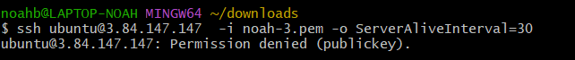

# Zugriff mit SSH-Key
---

## Passwort vs. SSH-Schlüssel
- **Passwort**:
  - Textbasierte Authentifizierung.
  - Kann leicht erraten oder geknackt werden, wenn es schwach ist.

- **SSH-Schlüssel**:
  - Kryptografisches Schlüsselpaar: öffentlicher und privater Schlüssel.
  - Sicherer als ein Passwort, da es auf komplexer Kryptographie basiert.
## SSH Login

- **Keypairs wurden erstellt und heruntergeladen**

- **Keypairs in git bash testen**
  ### Key 1
  ssh ubuntu@3.84.147.147  -i noah-1.pem -o ServerAliveInterval=30

  

### Key 2
- **Command:** ssh ubuntu@3.84.147.147  -i noah-3.pem -o ServerAliveInterval=30

### Instanz

### Key pairs
| Name   | Instance ID          | Instance State | Instance Type | Status Check      | Alarm Status | Availability Zone | Public IPv4 DNS                          | Public IPv4 Address | Elastic IP | IPv6 IPs | Monitoring | Security Group Name | Key Name | Launch Time            | Platform Details |
|--------|----------------------|----------------|---------------|-------------------|--------------|-------------------|------------------------------------------|---------------------|------------|----------|------------|---------------------|----------|-----------------------|------------------|
| kn02-b | i-0f397113bac70806d  | Running        | t2.micro      | 2/2 checks passed | 0 in alarm   | us-east-1a        | ec2-3-84-147-147.compute-1.amazonaws.com | 3.84.147.147        | –          | –        | disabled   | launch-wizard-2     | **noah-1**   | 2023/09/15 10:42 GMT+2 | Linux/UNIX       |

#### Reflexion
- Es geht nur mit dem ersten Key, da man mit dem gelauncht ist und somit nur mit dem sich authentifizieren. Man müsste den anderen Key also auch launchen.

