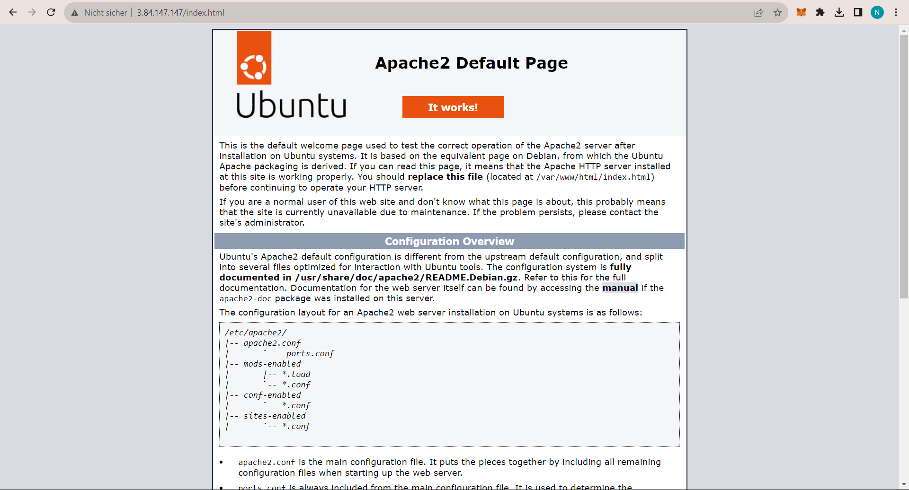
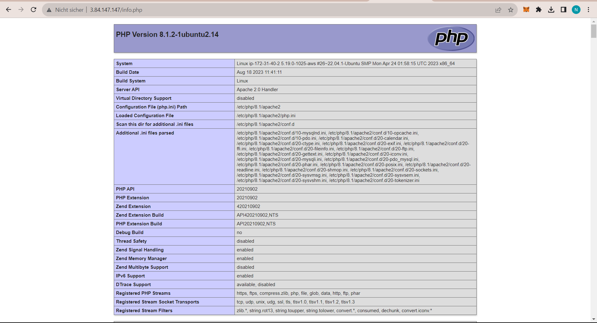
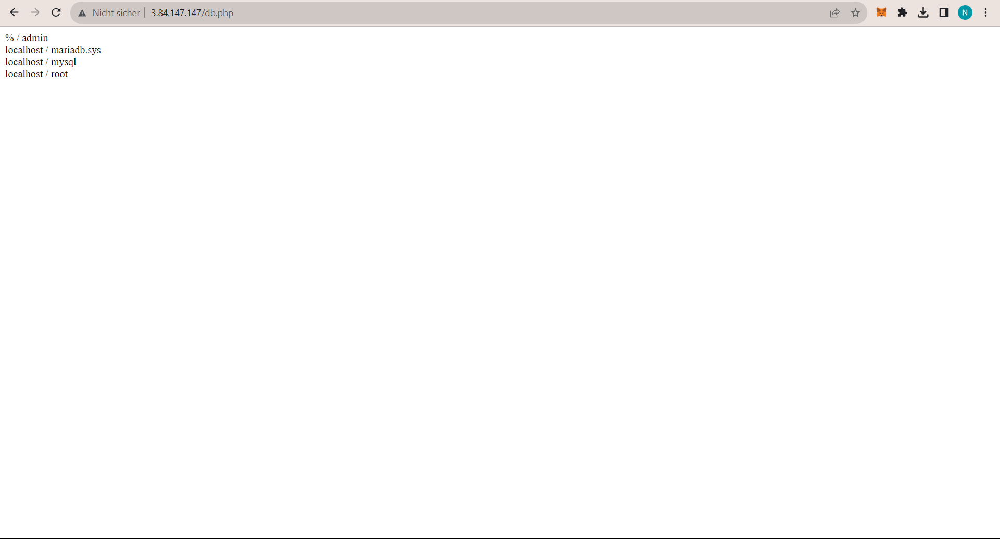

# Installation von Web- und Datenbankserver

- **URL von Apache:** http://3.84.147.147/index.html
  

- **URL von PHP:** http://3.84.147.147/info.php
 
- **URL von DB User** http://3.84.147.147/db.php
-  