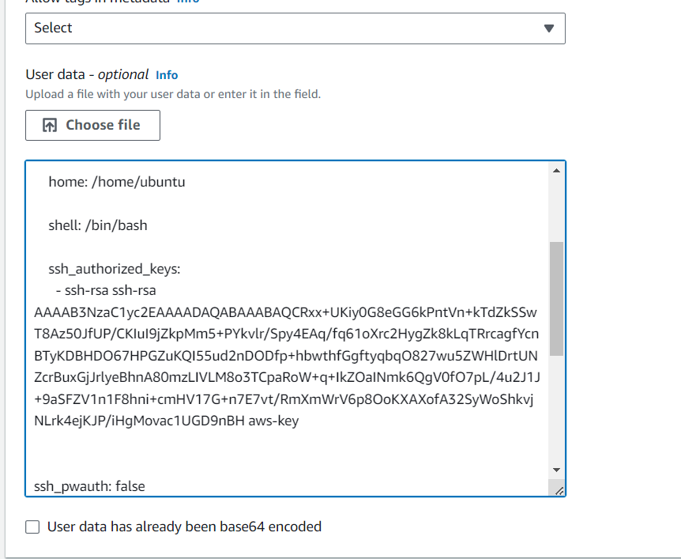

# SSH-Key und Cloud-init (Beginner)

### Ausgangslage:
Sie wissen bereits, wie man auf AWS ein SSH Keypair erstellt und können sich mit diesem Key per SSH mit einer Instanz in der Cloud verbindet. Dieser Challenge geht nun etwas tiefer. Weil das Keypair von AWS und nicht von Ihnen erzeugt wurde, fehlt ihnen noch der Public-Key zu Ihrem bereits bei sich abgelegten Private Key (file.pem). Mit puttygen können Sie jederzeit den zugehörigen Public Key erzeugen. Diesen können Sie dann auf jeder beliebigen Instanz in der Cloud ablegen, um schnell darauf zuzugreifen.

Anleitung
Anstatt, dass Sie den SSH-Key im GUI auswählen, können Sie ihn auch im Cloud-Init mitgeben. Dies werden wir folgend tun.  Installieren Sie puttygen, falls Sie es noch nicht haben (unter Quellen finden Sie den Link). Extrahieren Sie den öffentlichen Schlüssel (für beide Keys) wie folgt.

