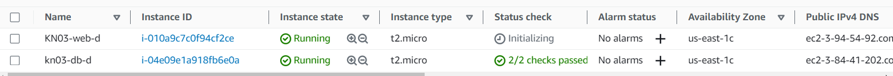
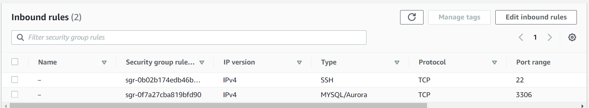
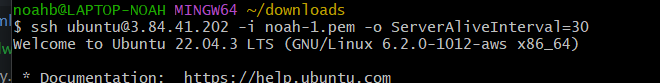
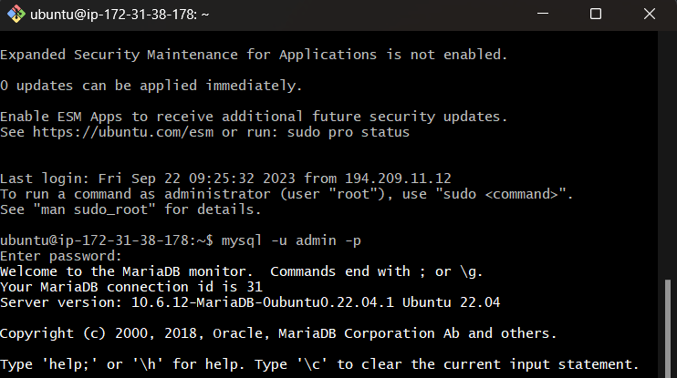
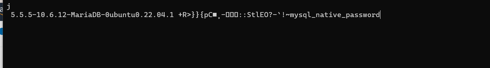
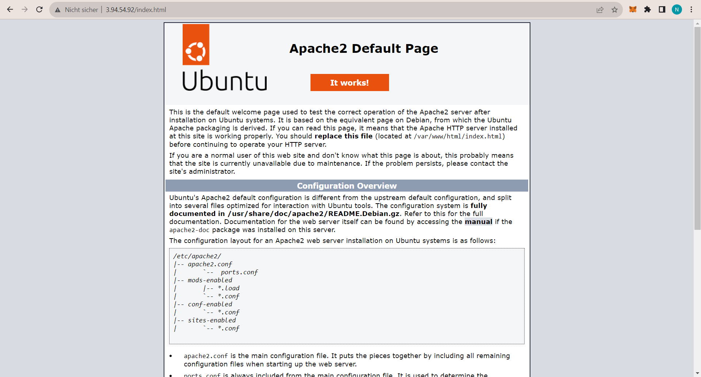
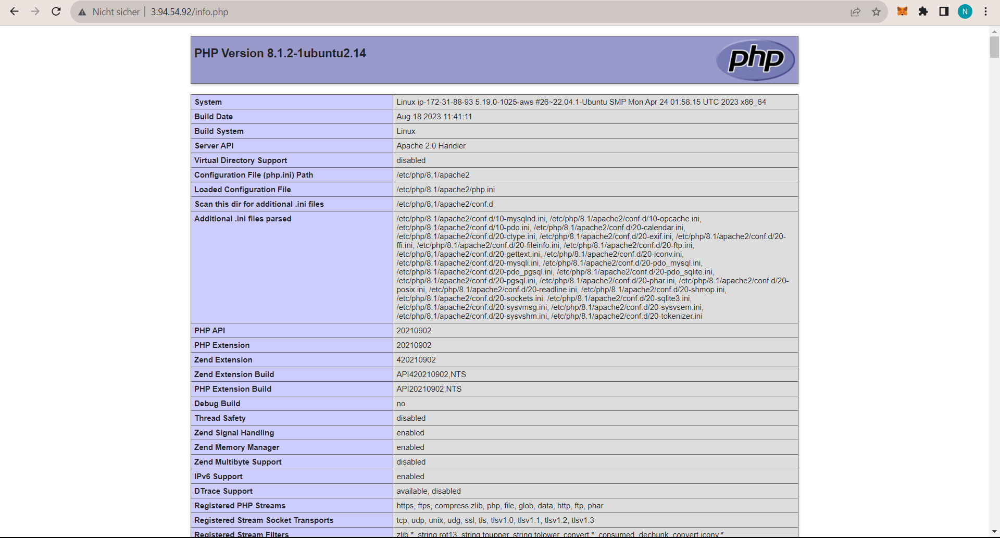
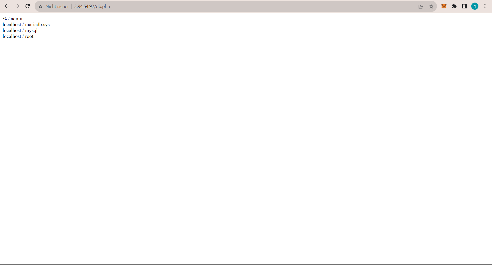
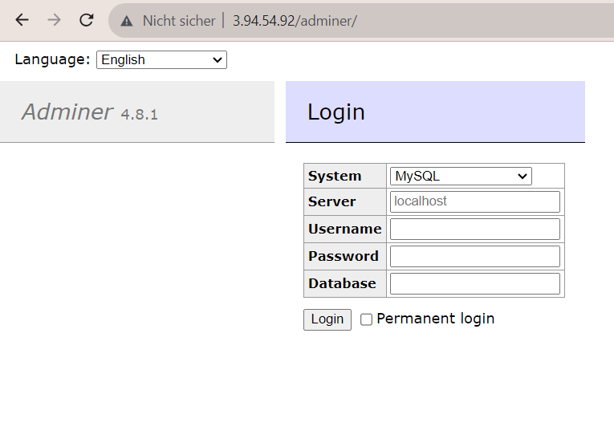
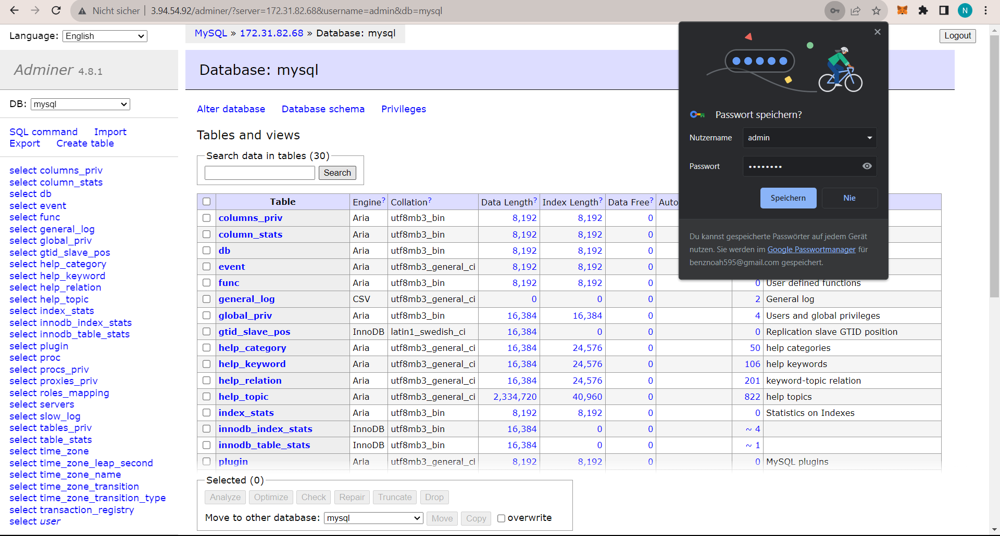

## D) Auftrennung von Web- und Datenbankserver (Advanced)

Früher basierte IT auf monolithischen Systemen mit komplexen Abhängigkeiten, die bei Änderungen zu Downtimes führten. Heute dominieren Microservices, die für mehr Skalierbarkeit und Flexibilität sorgen und den Trend zu agileren Softwareansätzen zeigen. Bei der Installation von Anwendungen wie in KN02 können durch Cloud-init Automatisierungen statt manuellen Wiederholungen erreicht werden. Dies fällt unter die Konzepte der deklarativen Methode und "Infrastructure as Code".

### Instanzbilder:

1. **DB and Web Instance**  
   

2. **Inbound Rule to DB**  
   

3. **Inbound Rule to Web**  
   

4. **Connecting to DB with Command**  
   

5. **MySQL Connection**  
   - Command: `sudo mysql -u admin -p`
   - Entered password: 'password'  
     

6. **Telnet Configuration**  
   

### Webseiten aufrufen:

1.  ### **Index.html**  
   

2.  ### **PHP Page**  
   

3.  ### **Database Page**  
   

4.  ### **Adminer Connection**  
   

5. ### **Zu DB**  
     
   Hinweis: Ich musste mich mit dem Login und der IP vom Db Server verbinden.
- In dieser URL befinde ich mich: http://3.94.54.92/adminer/?server=172.31.82.68&username=admin&db=mysql