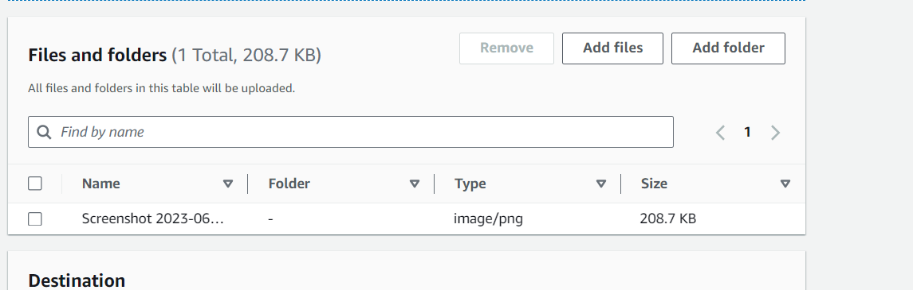
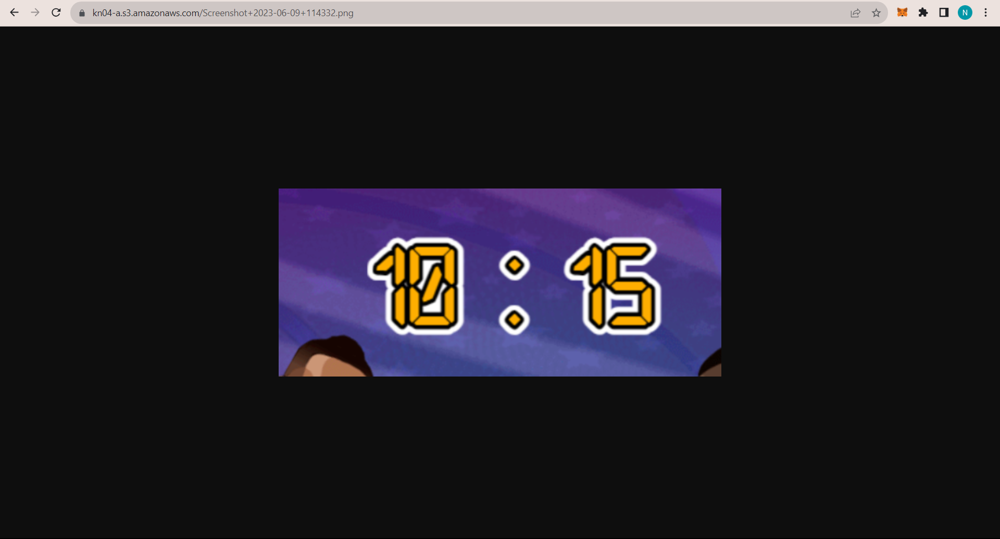

## S3 Bucket erstellen und Objekte darin ablegen (Beginner)

### Uploaded picture in Bucket

### Url von meinem Bild

[https://kn04-a.s3.amazonaws.com/Screenshot+2023-06-09+114332.png](https://kn04-a.s3.amazonaws.com/Screenshot+2023-06-09+114332.png)

### Aufruf

