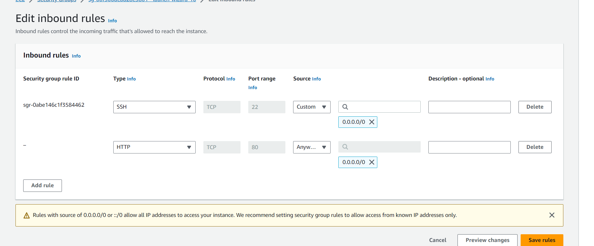

# EC2 Instanz Erstellung bei AWS

Während meiner Arbeit mit AWS beschloss ich, eine EC2-Instanz zu erstellen. Im Folgenden beschreibe ich die Schritte, die ich unternommen habe, und was ich während des Prozesses erlebt habe.

## Instanz benennen

Ich gab meiner EC2-Instanz einen eindeutigen Namen, der den Begriff "KN04" enthielt. Dies half mir, sie später leicht in der AWS-Konsole zu identifizieren.

## Auswahl eines Ubuntu AMI

Für mein Projekt entschied ich mich für ein Ubuntu AMI (Amazon Machine Image). AMIs sind im Grunde vorkonfigurierte Servervorlagen, und ich wollte etwas Vertrautes wie Ubuntu.

## Instanztyp und Key Pair

Ich wählte einen Instanztyp aus, der meinen Anforderungen entsprach, und verwendete ein bereits vorhandenes Schlüsselpaar, um später sicheren Zugriff auf die Instanz zu haben.

## Security Group

Ich stellte sicher, dass meine Security Group so konfiguriert war, dass der Port 80 inbound offen war. Das ist wichtig, um Webanfragen zuzulassen.

## Cloud-init Script

Ich verwendete ein Cloud-init-Script, um meine EC2-Instanz mit den erforderlichen Konfigurationen zu starten.

## URL-Zugriff

Nachdem alles eingerichtet war, öffnete ich meinen Browser und navigierte zu `174.129.182.14/yourfile.php`. Zu meiner Überraschung stellte ich fest, dass ich die Quelle falsch angegeben hatte.

---

Das war meine Erfahrung mit der Einrichtung einer EC2-Instanz bei AWS. Es gibt immer eine Lernkurve, aber am Ende war es eine bereichernde Erfahrung.
