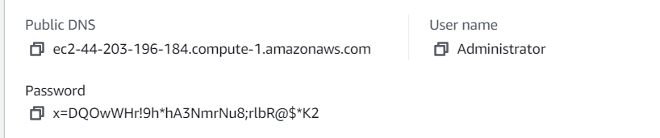
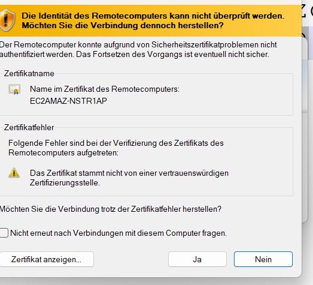
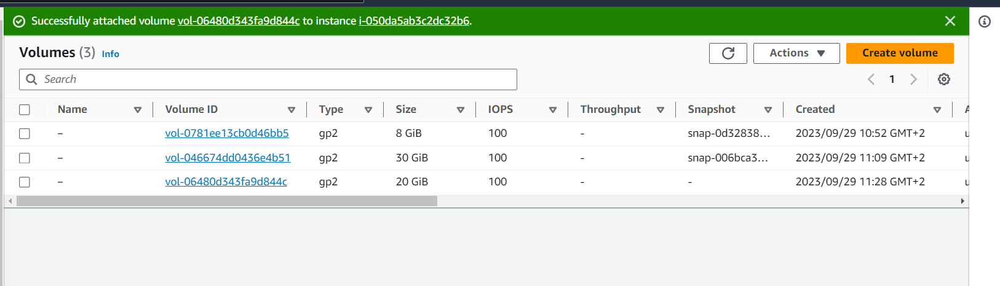
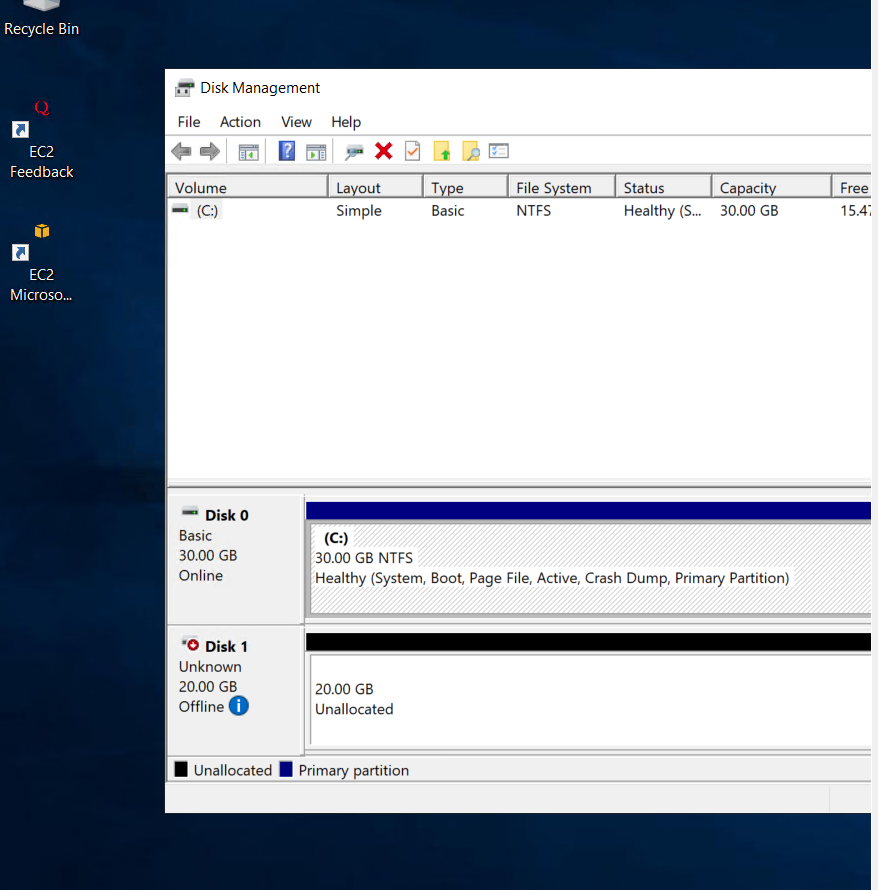
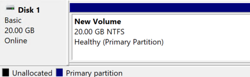
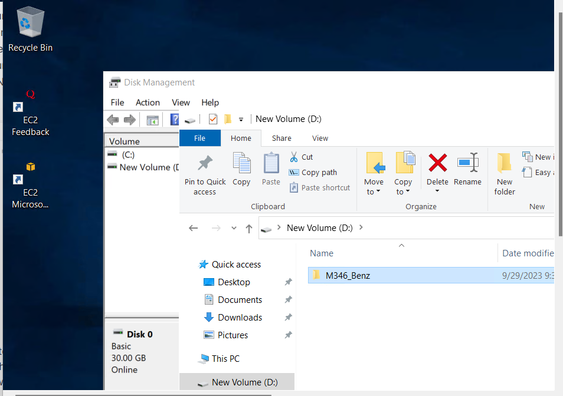

### Inbound Rules

| Name | Security group rule ID | IP version | Type | Protocol | Port range | Source    | Description  |
|------|------------------------|------------|------|----------|------------|-----------|--------------|
| –    | sgr-0474ef09127898b37  | IPv4       | HTTP | TCP      | 80         | 0.0.0.0/0 | –            |
| –    | sgr-0abe146c1f3584462  | IPv4       | SSH  | TCP      | 22         | 0.0.0.0/0 | –            |
| –    | sgr-07f2ed470de89030c  | IPv4       | RDP  | TCP      | 3389       | 0.0.0.0/0 | Web Zugriff  |

### Get password

## Mit RDP verbinden

## Attached Volume

## Wird angezeigt

## Volume der Partition hinzugefügt

## Ordner erstellt

