### Module 1 Check Test
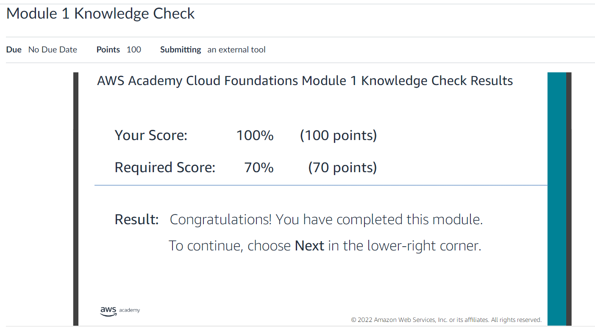

### Module 2 Check Test
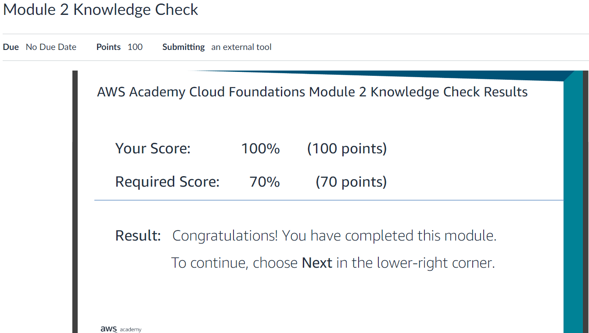

### Module 3 Check Test
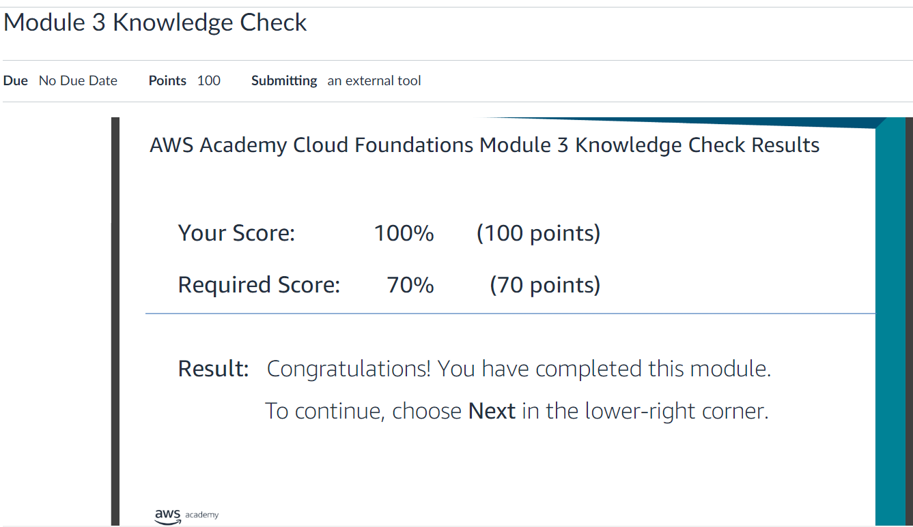

### Module 4 Check Test
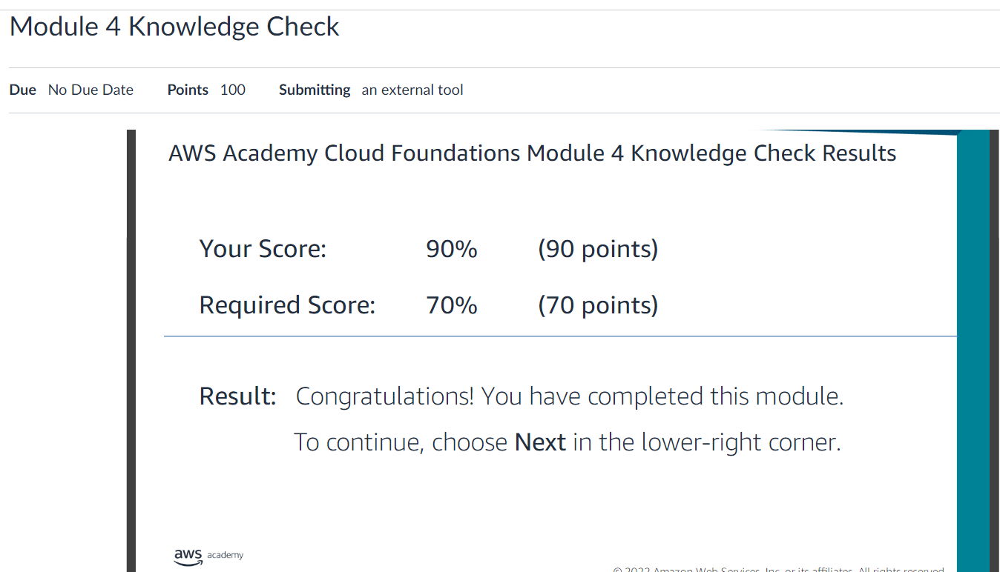

## A) Lab: VPC erstellen und einen Web Server darin deployen
Alle Settings darin setzen
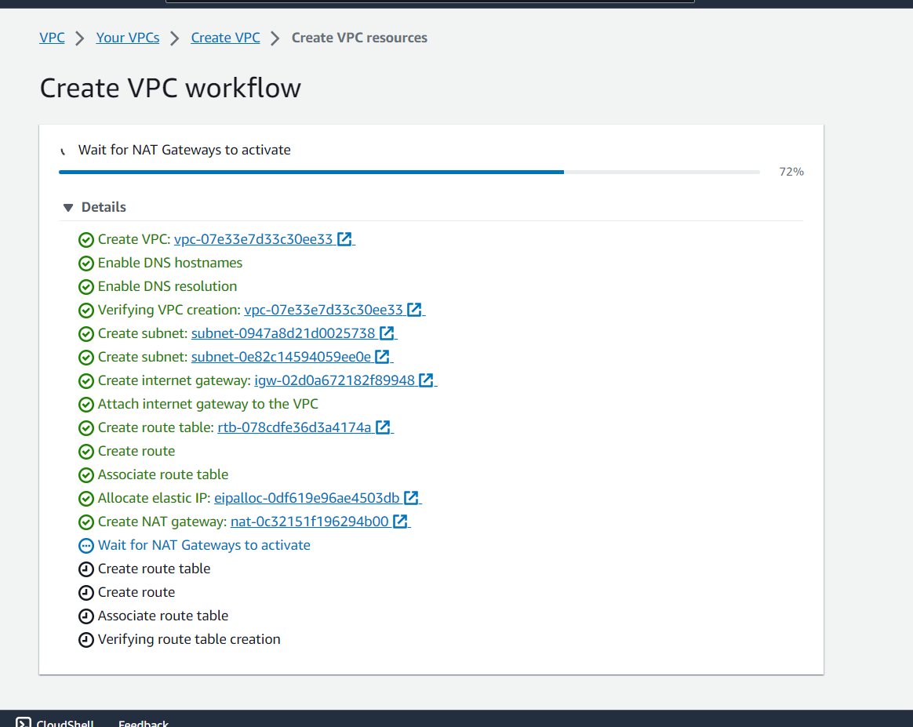

#### Subnetze
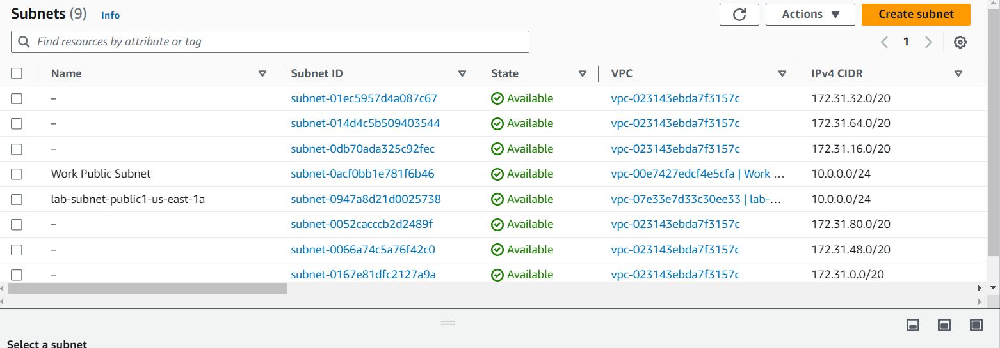
#### Neues Subnetz erstellt
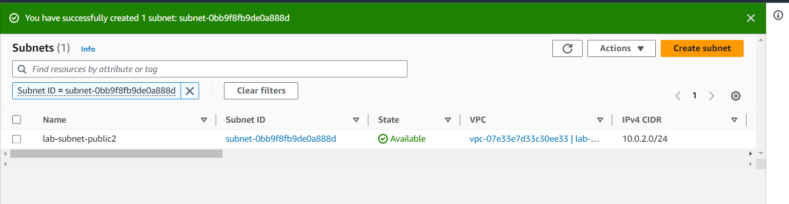
#### Privates Subnetz erstellt
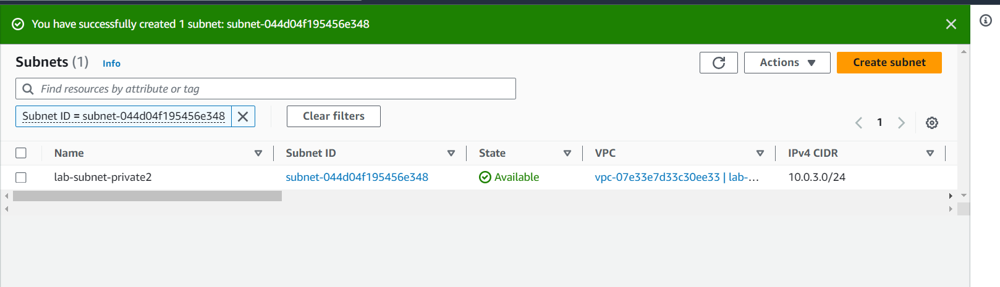

#### Route Destinations die alles ins öffentliche Netzwerk weiterleitet
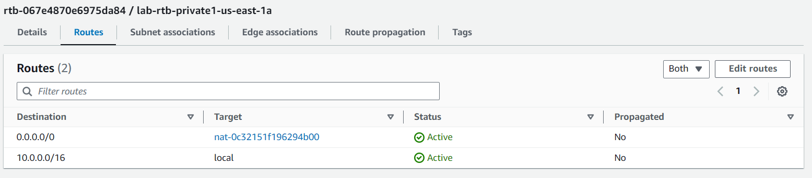

#### Privates und Öffentliches Subnetz erstellt
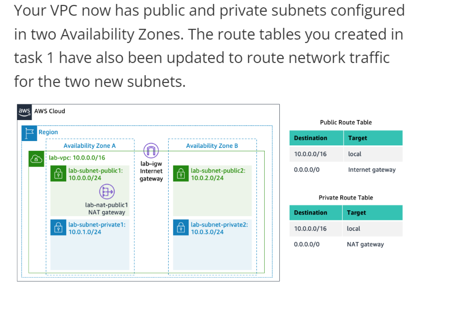

#### Inbound roule erstellt
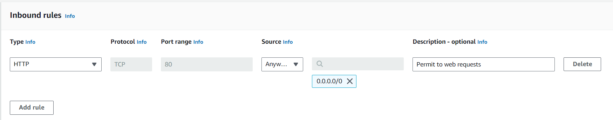
#### Subnetz zuweisen
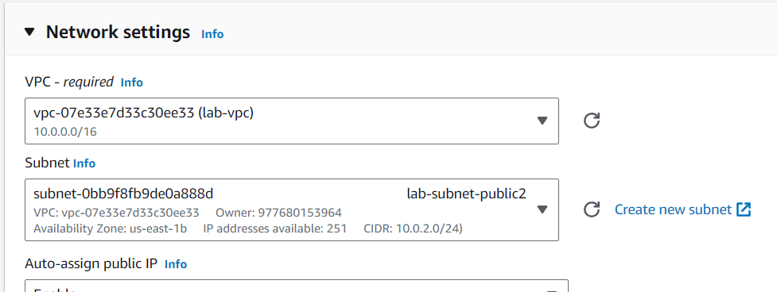

#### IPV4 aufrufen
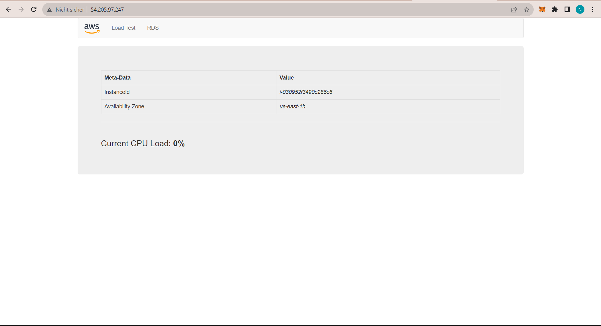

#### Test Loaden damit das ganze getestet wird
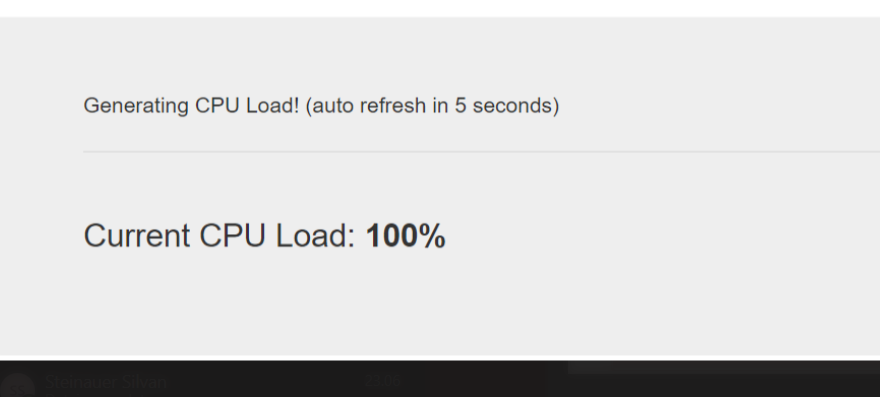

