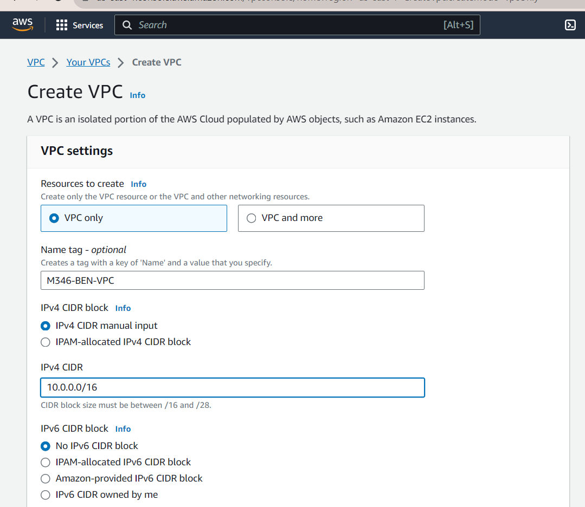
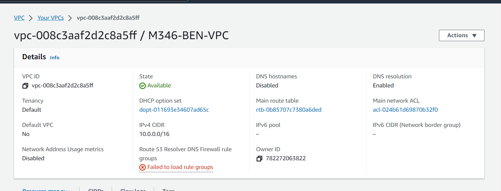
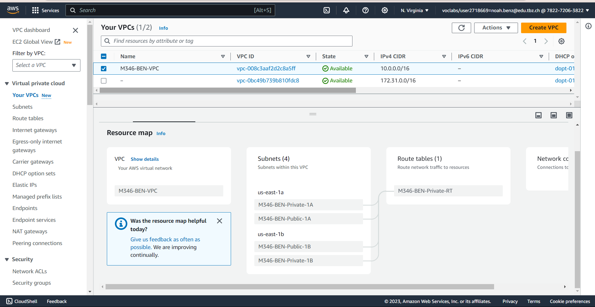
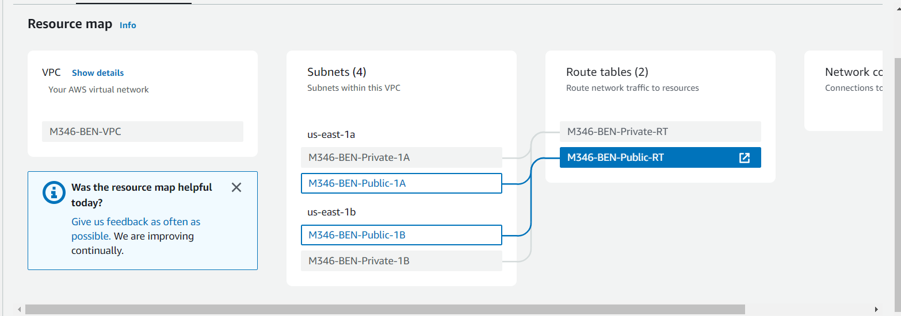
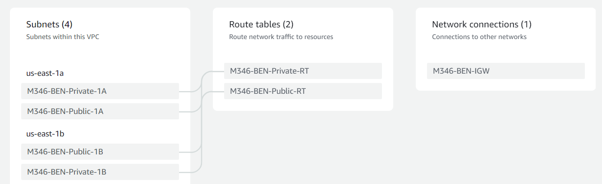
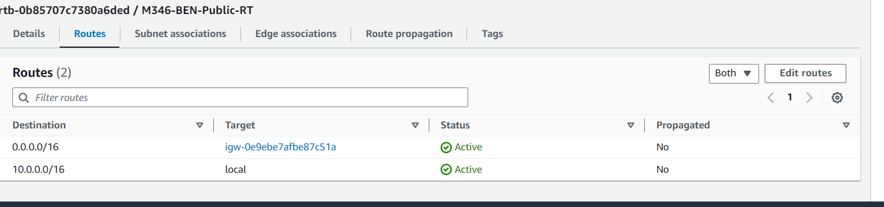
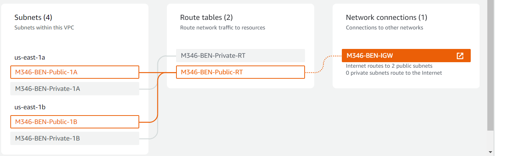

# B) Eigene VPC mit je zwei Public- und Private Subnets in zwei verschiedenen Availability Zones erstellen

#### VPC erstellen mit VPC only

#### VPC Details

#### Alle 4 Subnetze erstellt

#### Your VCP Map

#### Ressource Map

#### Internet gateway

#### Route attached

#### Public routes Verbindung hergestellt
