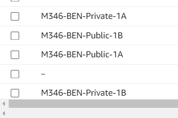

# B) Eigene VPC mit je zwei Public- und Private Subnets in zwei verschiedenen Availability Zones erstellen

#### VPC erstellen mit VPC only

#### VPC Details

#### Alle 4 Subnetze erstellt
| Name | Subnet ID | State | VPC | IPv4 CIDR | IPv6 CIDR | Available IPv4 addresses | Availability Zone | Availability Zone ID | Network border group | Route table | Network ACL | Default subnet | Auto-assign public IPv4 address | Auto-assign customer-owned IPv4 address | Customer-owned IPv4 pool | Auto-assign IPv6 address | Owner ID |
|------|-----------|-------|-----|-----------|-----------|---------------------------|-------------------|----------------------|----------------------|-------------|-------------|----------------|--------------------------------|----------------------------------------|--------------------------|-------------------------|----------------|
| -    | subnet-0059b527ee4fb200b | Available | vpc-041d74d62bec5c464 | 172.31.32.0/20 | – | 4091 | us-east-1b | use1-az6 | us-east-1 | rtb-0a8f5bdc9f79ce6e2 | acl-02d15acda6b7556e1 | Yes | Yes | No | - | No | 892650288512 |
| M346-BEN-Private-1B | subnet-04b4ed01dc3562a1e | Available | vpc-019f9c0c646a2bd8f | M346-BEN-VPC | 10.0.4.0/24 | – | 251 | us-east-1b | use1-az6 | us-east-1 | rtb-02d306918b0f638df | acl-0631c55526c8734ba | No | No | No | - | No | 892650288512 |
| M346-BEN-Public-1A | subnet-0e4665b209c5cc5b6 | Available | vpc-019f9c0c646a2bd8f | M346-BEN-VPC | 10.0.1.0/24 | – | 251 | us-east-1a | use1-az4 | us-east-1 | rtb-02d306918b0f638df | acl-0631c55526c8734ba | No | No | No | - | No | 892650288512 |
| -    | subnet-067488862fd83ab05 | Available | vpc-041d74d62bec5c464 | 172.31.80.0/20 | – | 4091 | us-east-1d | use1-az2 | us-east-1 | rtb-0a8f5bdc9f79ce6e2 | acl-02d15acda6b7556e1 | Yes | Yes | No | - | No | 892650288512 |
| M346-BEN-Private-1A | subnet-028de83f5078c813c | Available | vpc-019f9c0c646a2bd8f | M346-BEN-VPC | 10.0.3.0/24 | – | 251 | us-east-1a | use1-az4 | us-east-1 | rtb-02d306918b0f638df | acl-0631c55526c8734ba | No | No | No | - | No | 892650288512 |
| -    | subnet-04bf30efd9c22775f | Available | vpc-041d74d62bec5c464 | 172.31.64.0/20 | – | 4091 | us-east-1f | use1-az5 | us-east-1 | rtb-0a8f5bdc9f79ce6e2 | acl-02d15acda6b7556e1 | Yes | Yes | No | - | No | 892650288512 |
| -    | subnet-0110f82d81f3b44c5 | Available | vpc-041d74d62bec5c464 | 172.31.0.0/20 | – | 4091 | us-east-1c | use1-az1 | us-east-1 | rtb-0a8f5bdc9f79ce6e2 | acl-02d15acda6b7556e1 | Yes | Yes | No | - | No | 892650288512 |
| -    | subnet-04b1eba42cd039c4b | Available | vpc-041d74d62bec5c464 | 172.31.48.0/20 | – | 4091 | us-east-1e | use1-az3 | us-east-1 | rtb-0a8f5bdc9f79ce6e2 | acl-02d15acda6b7556e1 | Yes | Yes | No | - | No | 892650288512 |
| -    | subnet-0fbaae1c248271dc7 | Available | vpc-041d74d62bec5c464 | 172.31.16.0/20 | – | 4091 | us-east-1a | use1-az4 | us-east-1 | rtb-0a8f5bdc9f79ce6e2 | acl-02d15acda6b7556e1 | Yes | Yes | No | - | No | 892650288512 |
| M346-BEN-Public-1B | subnet-0d731afabda00f4b7 | Available | vpc-019f9c0c646a2bd8f | M346-BEN-VPC | 10.0.2.0/24 | – | 251 | us-east-1b | use1-az6 | us-east-1 | rtb-02d306918b0f638df | acl-0631c55526c8734ba | No | No | No | - | No | 892650288512 |

#### Your VCP Map

#### Ressource Map

#### Internet gateway

#### Route attached

#### Public routes Verbindung hergestellt
