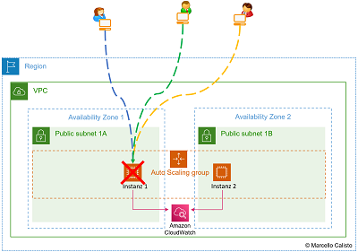

# Was ist ein Virtual Private Cloud (VPC)?

Ein **Virtual Private Cloud (VPC)** ist ein virtuelles Netzwerk in der Cloud, das es ermöglicht, Ressourcen wie Amazon Web Services (AWS)-Instanzen, Datenbanken und Anwendungen in einer isolierten und maßgeschneiderten Netzwerkumgebung auszuführen.

## Hauptmerkmale von VPC:

- **Isoliertes Netzwerk**: Ein VPC bietet eine isolierte Netzwerkumgebung in der Cloud. Das bedeutet, dass Ihre Cloud-Ressourcen in einem eigenen Netzwerksegment arbeiten und von anderen VPCs oder öffentlichen Netzwerken getrennt sind.

- **Kontrolle und Anpassung**: Sie können die Netzwerkkonfiguration Ihres VPCs nach Ihren Anforderungen anpassen. Das umfasst die Definition von IP-Adressbereichen, Routing-Tabellen, Sicherheitsgruppen und Netzwerkacl (Access Control Lists).

- **Sicherheit**: VPCs ermöglichen es Ihnen, Sicherheitsmaßnahmen wie Firewalls, Sicherheitsgruppen und Netzwerkacls zu implementieren, um den Zugriff auf Ihre Ressourcen zu steuern und zu schützen.

- **Verbindung mit dem Internet**: Sie können eine Verbindung zu öffentlichen Netzwerken wie dem Internet über Gateway-Dienste herstellen, wenn Sie dies benötigen. Dies ermöglicht es Ressourcen in Ihrem VPC, auf das Internet zuzugreifen und von dort aus erreichbar zu sein.

- **Private Subnetze**: Sie können private Subnetze innerhalb Ihres VPCs erstellen, in denen Ressourcen ohne direkte Verbindung zum Internet arbeiten. Dies bietet zusätzliche Sicherheit für bestimmte Anwendungsfälle.

- **Skalierbarkeit**: VPCs sind skalierbar. Sie können die Größe Ihres Netzwerks und die Anzahl der darin enthaltenen Ressourcen je nach Bedarf erhöhen oder reduzieren.

Insgesamt bietet ein VPC die Möglichkeit, eine sichere und maßgeschneiderte Netzwerkumgebung in der Cloud zu erstellen, die den Anforderungen Ihres Unternehmens entspricht. Es ist ein grundlegendes Konzept in Cloud-Umgebungen wie AWS, um Ressourcen zu organisieren und zu schützen.
