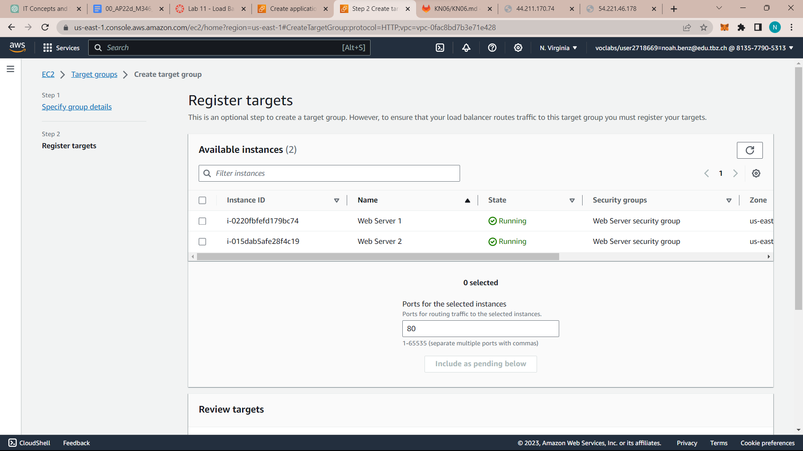
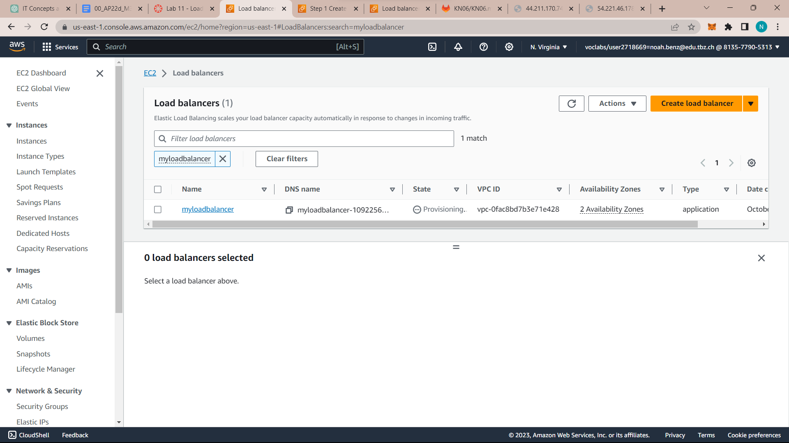

## EC2 Instanz launchen
```javascript
#!/bin/bash
yum update -y
yum -y install httpd
systemctl enable httpd
systemctl start httpd
echo '<html><h1>Hello World! This is server 1.</h1></html>' > /var/www/html/index.html
```

This script does the following:


Updates the server
Installs an Apache web server (httpd)
Configures the web server to automatically start on boot
Starts the web server
Creates a simple webpage 

## Access EC2 Instanz auf Website


## Create a second instance

## Register Targets

## Load Balancer

DNS: myloadbalancer-1092256527.us-east-1.elb.amazonaws.com
Video auf Handy gemacht, alles funktioniert!

