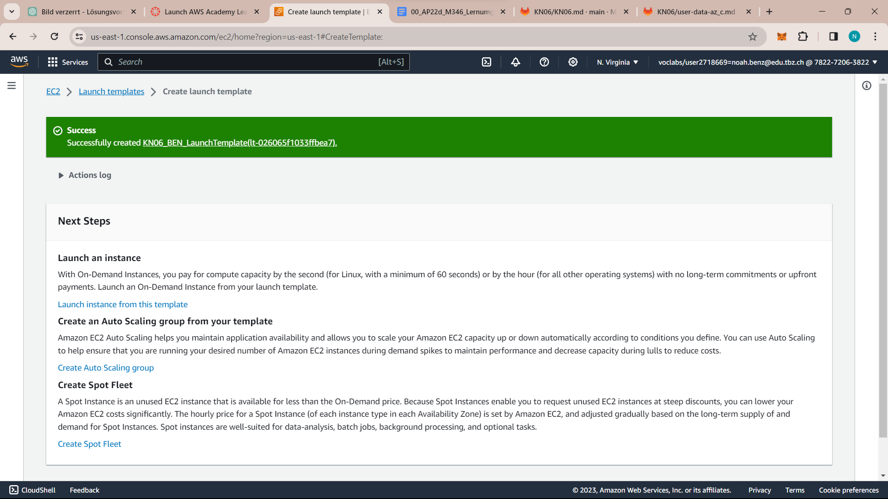
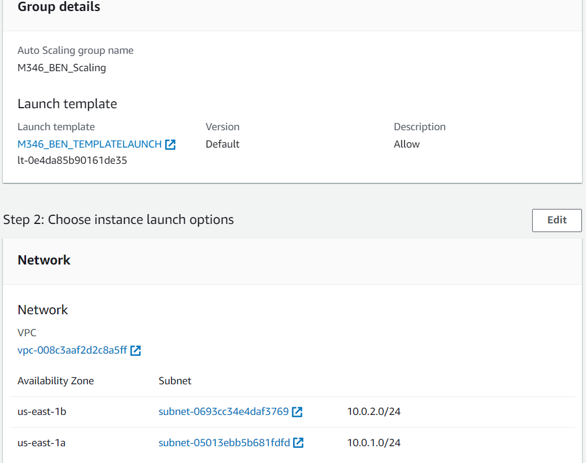

# C) Lab: Auto Scaling Group erstellen und anwenden

- Auto Scaling group erstellen und später beim Erstellen von neuen Instanzen nutzen.
- Kombiniert man den Auto Scaler mit den Load Balancer, erhält der dahinterliegende Service eine um einiges höhere Verfügbarkeit.

### Aufgaben des Auto Scalers:

- Launchen und terminieren von EC2-Instanzen dynamisch.
Horizontal skalieren (Scale out).

- Unterstützt Elasticity und Scalability.
Reagiert auf EC2 Status Checks und CloudWatch-Metrics.

- Skaliert On-demand (Performance) und/oder gemäss Planung (Falls man z.B. weiss, dass am Sonntagabend ein Backup-Job viel Ressourcen braucht).

- Template erstellt: 

### Auto Scaling group erstellt

### Probleme
