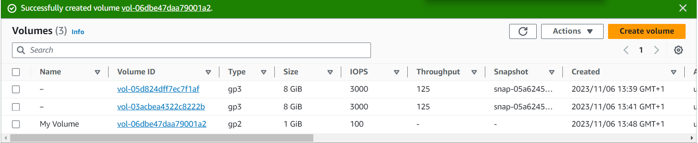
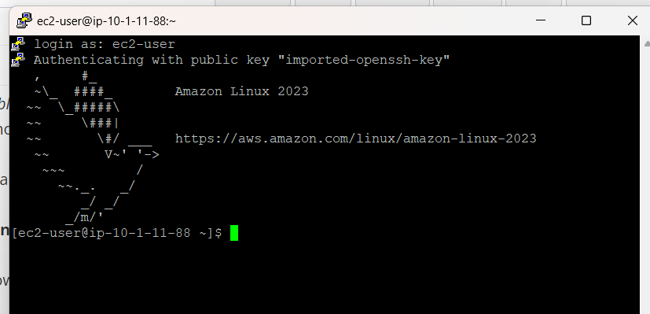
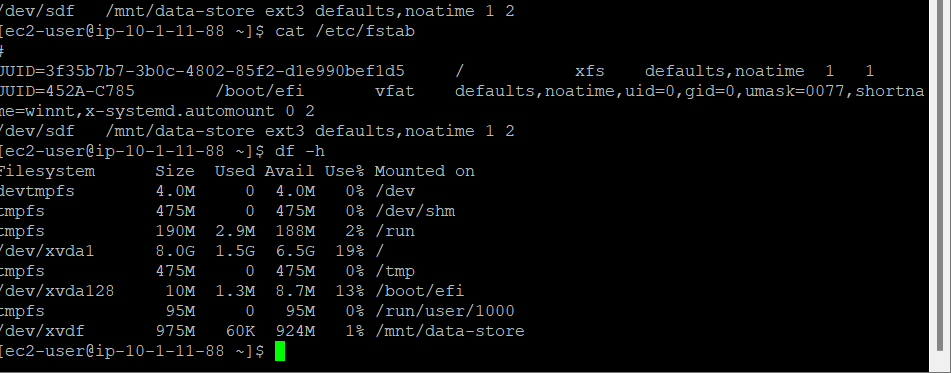
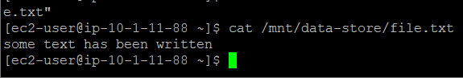
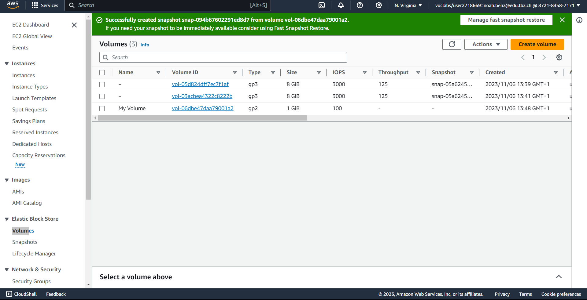
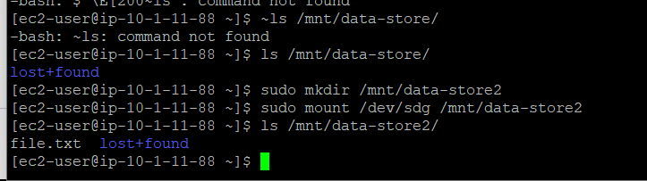

# B) Lab: EBS Volume Erstellung, Snapshot und neues Volume

## EBS (Elastic Block Store)
**Amazon EBS** ist ein zentraler Bestandteil der AWS-Dienstleistungen, der sich durch folgende Eigenschaften auszeichnet:
- **Persistente Speicherung**: Daten bleiben auch nach dem Stoppen der zugehörigen EC2-Instanz erhalten.
- **Skalierbarkeit**: Der Speicherplatz kann dynamisch an den Bedarf angepasst werden.
- **Datensicherung**: Durch die Snapshot-Funktionalität können Daten gesichert und wiederhergestellt werden.
- **Leistungsoptionen**: Verschiedene Typen wie SSD- oder HDD-basierte Volumes bieten Flexibilität für unterschiedliche Anwendungsfälle.

## Vorgehensweise im Lab

1. **Volume gestartet**:
   Ein neues EBS Volume wurde im AWS Management Console erstellt und ist nun einsatzbereit.
   

2. **Connected**:
   Das Volume wurde erfolgreich mit einer EC2-Instanz verbunden.
   

3. **Neues Volume hinzugefügt**:
   Ein zusätzliches EBS Volume wurde der Instanz hinzugefügt, um den Speicherplatz zu erweitern.
   

4. **Text file erstellt**:
   Innerhalb des EBS Volumes wurde eine Datei angelegt, um die Funktionalität des Speichers zu demonstrieren.
   

5. **Snapshot erstellt**:
   Von dem Volume mit der erstellten Datei wurde ein Snapshot gezogen, der für Backup-Zwecke genutzt werden kann.
   

6. **Snapshot wieder an Volume attachen**:
   Der erstellte Snapshot wurde als neues Volume wieder an eine EC2-Instanz angehängt, um die Datenwiederherstellung zu simulieren.
   
